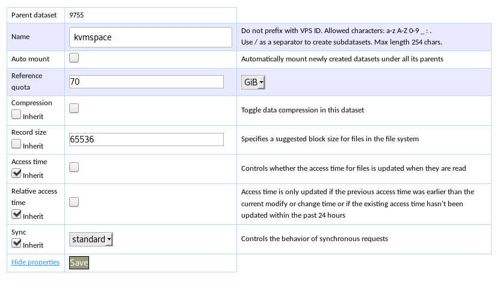
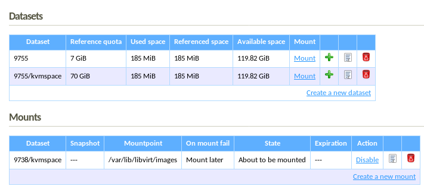

VPSfree je velmi příjemný hosting, který kloubý dobrou cenu a komunitní přístup.

## KVM na VPSfree

|||
|-------|-|
| HOST  | Server na kterém běží virtualizace. |
| QUEST | Server, který je virtualizován.     |


Oficiální návod: https://kb.vpsfree.cz/navody/vps/kvm

1. Využijeme předpřipravený **obraz Debian 8**
2. Nastavit **uložiště**:
  1. Vypneme virtuál
  2. Defaultní dataset zmenšíme. Já jsem zvolil velikost 7 GB, což pro HOSTa stačí
  3. Vytvoříme nový subdataset, důležité je:
    - no automount
    - Vypnout kompresi
    - Record size na 65536 B.
    - velikost jsem zvolil 70 GB
    
    
  4. Dataset namountujeme na `/var/lib/libvirt/images/`
3. V nastavení VPS nastavíme:
  - Bridge – povolí vytvoření síťového bridge, do kterého následně připojíte KVM virtuály,
  - TUN/TAP - povolí vytváření virtuálních interface, které jsou pak bridgovány,
  - iptables – povolí použití iptables, které jsou potřeba pro nastavení IP maškarády,
  - KVM – povolí použití KVM (pro HW podporu virtualizace).
4. Update a balíčky:
	```bash
	apt-get update
	apt-get upgrade
	```
5. Instalace KVM a nastavení práv:
  ```bash
  apt-get install qemu-kvm libvirt-bin virt-manager
	chown root:kvm /dev/net/tun
  ```
6. Stáhnout instalační ISO:
	```bash
	cd /var/lib/libvirt/images/
	wget http://releases.ubuntu.com/16.04.3/ubuntu-16.04.3-server-amd64.iso
	```
7. Zkontrolujeme, že KVM běží:
  ```bash
  systemctl status libvirtd
  virsh --connect qemu:///system list --all
  ```
  A zde dostanu chybu 1.
8. Nastavíme bridge
	https://www.linux.com/learn/intro-to-linux/2017/5/creating-virtual-machines-kvm-part-1
	https://www.linux.com/learn/intro-to-linux/2017/5/creating-virtual-machines-kvm-part-2-networking
	https://help.ubuntu.com/community/KVM/Networking
9. Na lokálním PC spustíme virt-manager a připojíme se přes SSH. Nyní máme i grafickou obrazovku, čili můžeme snadno nainstalovat příslušný stroj

### Chyba 1

```bash
root@kvmhost:~# systemctl status libvirtd
● libvirtd.service - Virtualization daemon
 Loaded: loaded (/lib/systemd/system/libvirtd.service; enabled)
 Active: active (running) since Sun 2017-12-10 12:11:48 UTC; 28s ago
   Docs: man:libvirtd(8)
         http://libvirt.org
Main PID: 349 (libvirtd)
 CGroup: /system.slice/libvirtd.service
         └─349 /usr/sbin/libvirtd

Dec 10 12:11:48 kvmhost systemd[1]: Started Virtualization daemon.
Dec 10 12:11:48 kvmhost libvirtd[349]: libvirt version: 1.2.9, package: 9+deb8u4 (buildd 2017-03-29-21:11:06 binet)
Dec 10 12:11:48 kvmhost libvirtd[349]: Failed to get udev device for syspath '/sys/devices/virtual/dmi/id' or '/sys/class/dmi/id'
Dec 10 12:11:48 kvmhost libvirtd[349]: internal error: Child process (/usr/sbin/dmidecode -q -t 0,1,4,17) unexpected exit status 1: /dev/mem: No such file or directory
Dec 10 12:11:48 kvmhost libvirtd[349]: internal error: Child process (/usr/sbin/dmidecode -q -t 0,1,4,17) unexpected exit status 1: /dev/mem: No such file or directory
Dec 10 12:11:48 kvmhost libvirtd[349]: libnuma: Warning: /sys not mounted or invalid. Assuming one node: No such file or directory
Dec 10 12:11:48 kvmhost libvirtd[349]: NUMA topology for cell 0 is not available, ignoring
Dec 10 12:11:48 kvmhost libvirtd[349]: internal error: Child process (/usr/sbin/dmidecode -q -t 0,1,4,17) unexpected exit status 1: /dev/mem: No such file or directory
```

### Debian 9

```
apt install qemu-kvm libvirt-clients libvirt-daemon-system libvirt-daemon virt-manager
```
