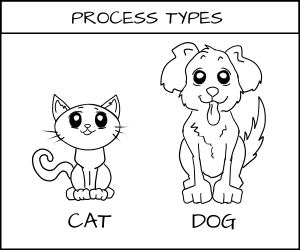
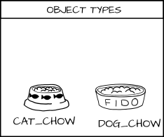
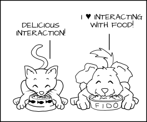

#SELinux

Unixový systém oprávnění je [DAC][4] (discretionary access control), SELinux je [MAC][5] (mandatory access control). Oba dva systémy oprávnění fungují najednou a neinteragují spolu, čili pokud nastavíte přístup v jednom, neznamená to, že se tak stane v druhém.

## Jak funguje


|Kdo, co?                          | Nazev   |
|----------------------------------|---------|
|proces                            | label   |
|file, dir, object (port, device)  | label   |
|rules for labels                  | policy  |

V SELinuxu co není dovoleno, je zákázáno. Systémy samozřejmě obsahují základní politiky, ale většinou velmi brzy narazíte na běžnou operaci, která je zakázána.

SELinux label:
```
User:Role:Type:level
```

### Příklad

Mějme:
* procesy: `cat`, `dog`
* objekty: `cat_chow`, `dog_chow`







Nyní `cat` i `dog` nesmějí pracovat s objekty. Co není povoleno, je zakázáno.

Až když nastavíme příslušné politiky, tak budou moci:

```
allow cat cat_chow:food eat;
allow dog dog_chow:food eat;
```




Pokud by chtěl proces přistoupit ke zdroji, který nemá povolen, tak by byl zastaven.


### Příklad 2


Apache má label `httpd_t`.

Webové soubory mají labely: `httpd_sys_content_t` a `httpd_sys_content_rw_t`.

MySQL databáze (soubory) májí label: `mysqld_data_t`.

Pokud by byl Apache byl kompromitován, tak by útočník měl kontrolu nad `httpd_t`, číst by mohl
`httpd_sys_content_t` a zapisovat do `httpd_sys_content_rw_t`, avšak nedostal by se k `mysqld_data_t` (i kdyby byl root).

## Ovládání
Klasické unixové příkazy mají argument `-Z`, který nám dovoluje pracovat s SELinux labely. Takovými příkazy jsou např. `ls`, `id`, `ps`, `netstat`, `cp`, `mkdir`. Např.:

```
[keddie@localhost www]$ pwd
/var/www
[keddie@localhost www]$ ls -Z
drwxr-xr-x. root root system_u:object_r:httpd_sys_script_exec_t:s0 cgi-bin
drwxr-xr-x. root root system_u:object_r:httpd_sys_content_t:s0 html
```

Hlavním nástrojem je `chcon` (change context), popřípadě `restorecon`.


```
chcon --reference /var/www/html/ /var/www/html/myNewProject
```

`getsebool -a`

Ve Fedoře je grafická aplikace, která nás upozorní, pokud SELinux něco zamezoval (podezřelé chování). Pokud bychom ji neměli, tak zprávy najdeme v: `/var/log/messages`.

## Konfigurace

Je v souboru `/etc/selinux/config`:
```
# This file controls the state of SELinux on the system.
# SELINUX= can take one of these three values:
#     enforcing - SELinux security policy is enforced.
#     permissive - SELinux prints warnings instead of enforcing.
#     disabled - No SELinux policy is loaded.
SELINUX=enforcing
# SELINUXTYPE= can take one of these three values:
#     targeted - Targeted processes are protected,
#     minimum - Modification of targeted policy. Only selected processes are protected. 
#     mls - Multi Level Security protection.
SELINUXTYPE=targeted 
```

[2]: http://youtu.be/MxjenQ31b70 "YT1"
[3]: http://opensource.com/business/13/11/selinux-policy-guide "GUIDE"
[4]: http://cs.wikipedia.org/wiki/Discretionary_Access_Control  "DAC"
[5]: http://cs.wikipedia.org/wiki/Mandatory_access_control "MAC"
